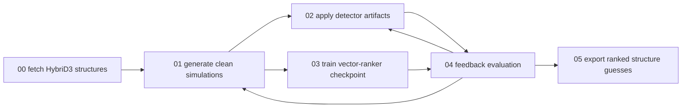

# Trigger-Based Training Infrastructure

Date: 2026-05-29

## Purpose

The data-training infrastructure is organized as six independent triggers. Each
trigger is a run folder with a single `run.sh` entry point. The default settings
are local smoke tests; the same folders can run on CU Boulder Alpine when paths
are pointed to `$SCRATCH` and the HybriD3 mode is changed from `fixture` to
`live`.

## Trigger Graph



The feedback edge means metrics can adjust the next simulation sweep, artifact
distribution, or model configuration. It does not imply that training is
launched automatically.

## 00 Fetch HybriD3 Structures

This trigger queries the HybriD3/MatD3 REST API for visible atomic-structure
datasets, inspects the dataset HTML page and JSmol input endpoint for
downloadable `media/data_files` links, downloads structure-like files, converts
FHI-aims `geometry.in` files to POSCAR/VASP format, and writes:

- `hybrid3_structure_catalog.yaml`
- `hybrid3_ingest_manifest.jsonl`
- raw downloaded files
- converted simulator-readable files

The parser accepts common HybriD3 structure variants: CIF/MCIF, POSCAR/CONTCAR,
VASP-style files, FHI-aims `geometry.in`, CASTEP `.cell`, extended XYZ with a
`Lattice="..."` header, PDB files with `CRYST1`, simple SHELX `.res/.ins`, and
ZIP/TAR bundles containing any of those files. Raw gzip-wrapped variants such as
`.cif.gz` or `POSCAR.gz` are decompressed before conversion. Unsupported
downloaded files are kept in the raw folder and marked missing in the ingest
manifest rather than silently entering the simulation catalog.

The catalog keeps two classes of metadata. The API metadata records compound
formula, organic formula, inorganic formula, IUPAC name, dimensionality,
sample/provenance fields, reference fields, synthesis/experimental/computational
links, and HybriD3 subset cell values when present. The file metadata records
CIF/POSCAR crystallographic facts such as lattice parameters, crystal system,
space-group name, formula moieties, element counts, atom-site counts, and
species counts.

The MatD3 documentation lists `/materials/datasets/` as a REST endpoint and
shows paginated `requests` access. HybriD3's public materials-database page
describes the database as experimental and computational materials data for
crystalline organic-inorganic compounds.

## 01 Generate Clean Simulations

This trigger uses the EWALD GIWAXS simulator to create clean images and
structured truth tables. For structure `S_j` and condition `c`, the clean image
is

```math
\ket{I_{j,c}^{0}} = D_g P T_c \ket{S_j},
```

where `T_c` applies texture/orientation, `P` projects Bragg reflections into the
2D q-map, and `D_g` samples detector/q-space geometry.

YAML generation plans may define either one `detector` mapping or a
`detectors` list. The Alpine-oriented plan uses this to evaluate each structure
across multiple detector windows, incident angles, q-ranges, and correction
settings before the artifact trigger expands the clean truth images.

The manifest records the clean image path and the peak table:

```math
\mathcal{P}_{j,c} =
\{(h_n,k_n,l_n,q_{xy,n},q_{z,n},I_n,A_n)\}_{n=1}^{N}.
```

## 02 Apply Detector Artifacts

This trigger takes clean images and applies stochastic artifact operators:

```math
\ket{I_{j,c,\alpha}} = A_\alpha \ket{I_{j,c}^{0}}.
```

The first artifact implementation includes background gradients, diffuse rings,
parasitic streaks, flat-field variation, Poisson noise, read noise, hot/dead
pixels, detector gaps, beamstop shadow, and saturation. These choices are
consistent with synthetic scattering data practice, where masks, parasitic
streaks, and Poisson noise are useful for training realistic classifiers, and
with GIWAXS peak-detection benchmarks that emphasize detector gaps and
reciprocal-space peak annotations.

## 03 Deploy Ranker Training

This trigger currently builds a baseline vector-ranker checkpoint. It does not
train a deep model. The checkpoint stores clean simulation candidates used for
the normalized overlap score:

```math
s(j,c) = \braket{\phi_{j,c}|\psi}.
```

This is the deployment placeholder for future deep-learning training. When the
real model is added, it should keep the same manifest/checkpoint output
contract so SLURM and feedback scripts do not need to change.

## 04 Feedback Evaluation

This trigger evaluates artifact images against the current ranker and appends
epoch-style metrics:

```math
\mathrm{top}\text{-}k =
\frac{1}{N}
\sum_{i=1}^{N}
\mathbf{1}\{S_i \in \operatorname{rank}_k(I_i)\}.
```

The output metrics can be grouped by artifact profile, structure family,
orientation family, and peak count. Later training loops should call this stage
between epochs or after each checkpoint, then use the failure modes to decide
which simulations/artifacts to sample next.

## 05 Export Ranked Structure Guesses

This trigger applies the current ranker to artifact images, copies the top-k
known structure files into per-sample guess folders, and writes
`ranked_guesses.json`. It is the deployment bridge between ML retrieval scores
and EWALD's structure-analysis tools: a downstream solver can open the copied
CIF/POSCAR files, rerun refined simulations, and report residuals.

## Alpine Run Contract

Every trigger writes into a run root:

```text
RUN_INFO.txt
*.log
manifest_path.txt / model_path.txt / metrics_path.txt
stage-specific outputs
```

On Alpine, set:

```bash
export EWALD_RUN_BASE="$SCRATCH/ewald-training/runs"
export EWALD_CONDA_ENV="ewald-py312"
```

Then execute the trigger's `run.sh`. Production HybriD3 ingestion should use:

```bash
export EWALD_HYBRID3_MODE=live
export EWALD_HYBRID3_LIMIT=0
```

Large images stay under scratch. Only manifests, metrics, model cards, and
selected previews should be synchronized back by default.

## Citations And Sources

- HybriD3 materials database overview:
  <https://hybrid3.duke.edu/research/materials-database>
- MatD3 REST API documentation:
  <https://hybrid3-database.readthedocs.io/en/latest/website.html#rest-api>
- HybriD3 2026 database webinar summary:
  <https://hybrid3.duke.edu/workshops/2026-hybrid3-database-webinar>
- CrystalX JACS paper:
  <https://pubs.acs.org/doi/10.1021/jacs.5c21832>
- CrystalX model card:
  <https://huggingface.co/Kaipengm2/CrystalX>
- Synthetic X-ray scattering dataset:
  <https://acdc.alcf.anl.gov/mdf/detail/pub_94_yager_synthetic_v1.2/>
- GIWAXS peak-detection benchmark:
  <https://pmc.ncbi.nlm.nih.gov/articles/PMC11957406/>
- pyFAI detector/mask/distortion documentation:
  <https://pyfai.readthedocs.io/en/stable/>
- pygidSIM:
  <https://pypi.org/project/pygidsim/>
