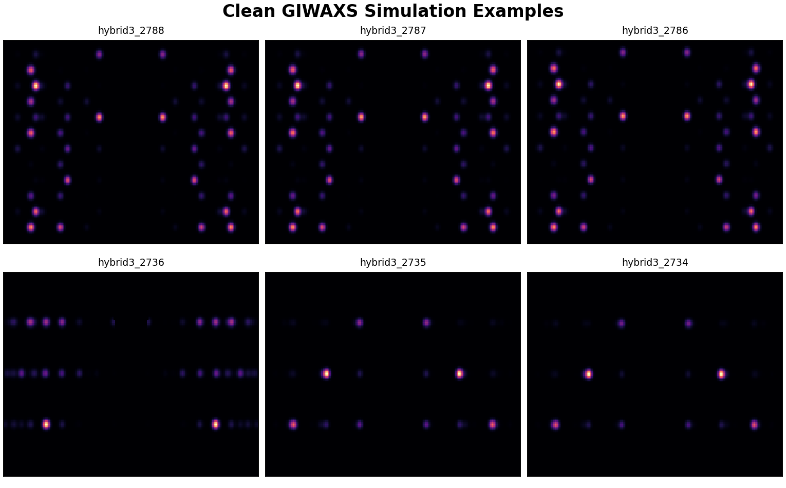
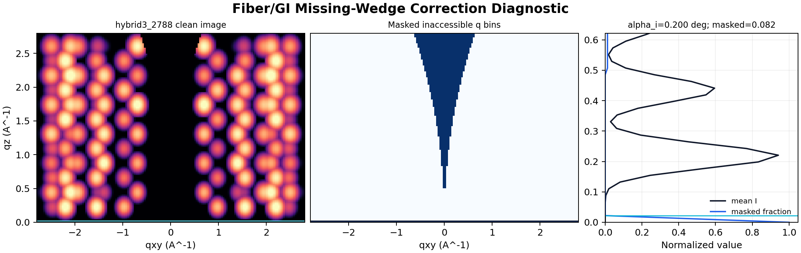
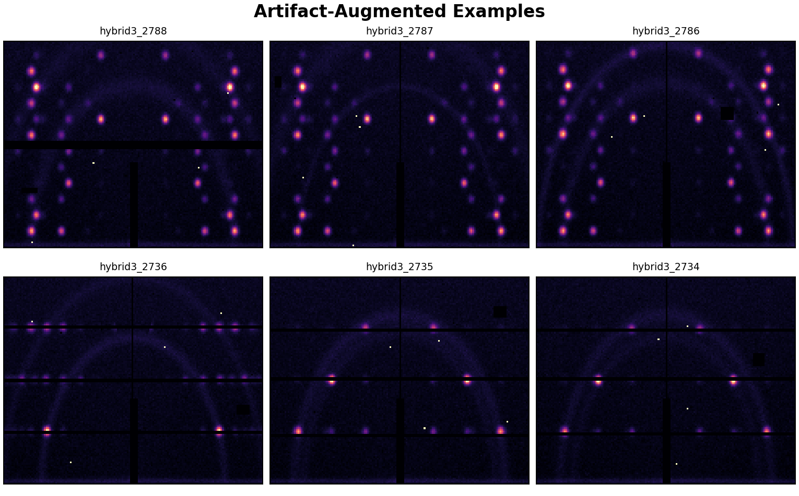
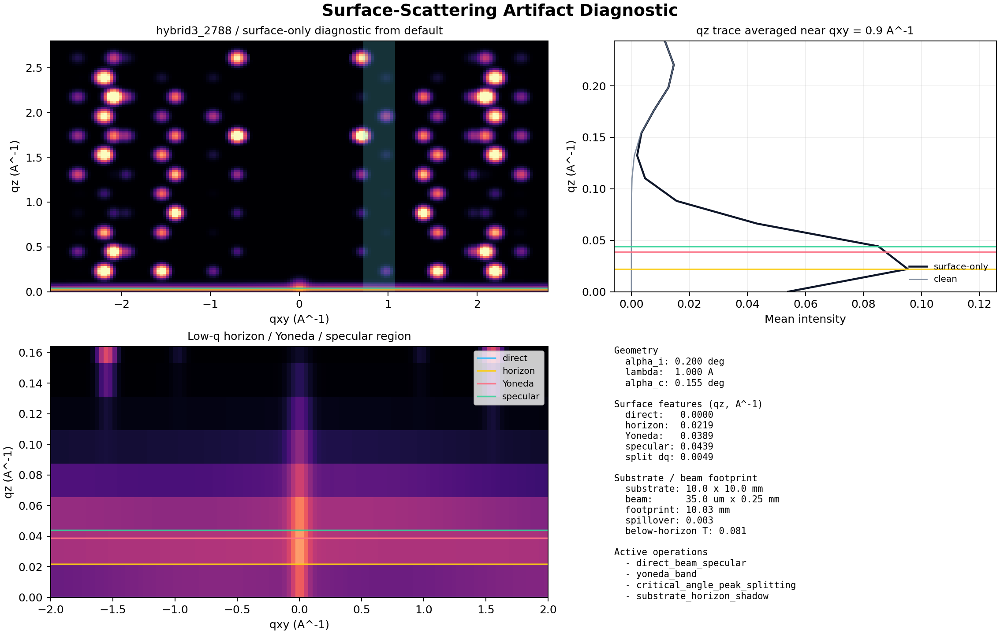

# HybriD3 Local Training Scaffold Test

Date: 2026-05-30

PDF version: [hybrid3-local-training-scaffold-test.pdf](hybrid3-local-training-scaffold-test.pdf)

## Summary

This local smoke study pulled ten similar HybriD3 atomic-structure records,
cataloged their database and crystallographic metadata, generated a compact
GIWAXS simulation set for 2D fibril-textured samples, applied detector-image
artifacts, trained the baseline vector ranker, evaluated top-k recovery, and
exported ranked structure-file guesses.

| Quantity                              |   Value |
| ------------------------------------- | ------: |
| Structures pulled                     |      10 |
| Clean simulation samples              |      20 |
| Artifact-augmented samples            |      80 |
| Missing-wedge corrected clean samples | 20 / 20 |
| Median missing-wedge masked fraction  |   0.082 |
| Surface-artifact augmented samples    |      60 |
| Ranker candidates                     |      20 |
| Evaluated artifact images             |      80 |
| Solvable augmented fraction           |   1.000 |
| Median artifact SNR                   |   13.49 |
| Top-1 accuracy                        |   0.988 |
| Top-5 accuracy                        |   1.000 |

## Pulled Structure Cohort

Selection targeted visible HybriD3 atomic-structure datasets with 2D `PbI4`
lead-iodide inorganic sublattices. This gives a chemically coherent local test
set for fibril-textured GIWAXS recognition while keeping the run small.

| Dataset | Structure id   | Inorganic         | Organic | File                                            | Sites |
| ------: | -------------- | ----------------- | ------- | ----------------------------------------------- | ----: |
|    2788 | `hybrid3_2788` | PbI4              | C4H9NI  | `dataset_2788_20231011_MC3I_PbI_380K_red.cif`   |    20 |
|    2787 | `hybrid3_2787` | PbI4              | C4H9NI  | `dataset_2787_20250421_MC3I_PbI_360K_1_red.cif` |    20 |
|    2786 | `hybrid3_2786` | PbI4              | C4H9NI  | `dataset_2786_MC3PI_100K.cif`                   |    20 |
|    2736 | `hybrid3_2736` | PbI4, Lead iodide | C7H9IN  | `dataset_2736_geometry.vasp`                    |    82 |
|    2735 | `hybrid3_2735` | PbI4, Lead iodide | C7H9BrN | `dataset_2735_geometry.vasp`                    |    82 |
|    2734 | `hybrid3_2734` | PbI4, Lead iodide | C7H9ClN | `dataset_2734_geometry.vasp`                    |    82 |
|    2733 | `hybrid3_2733` | PbI4, Lead iodide | C7H9FN  | `dataset_2733_geometry.vasp`                    |   164 |
|    2732 | `hybrid3_2732` | PbI4, Lead iodide | C6H18N2 | `dataset_2732_geometry.vasp`                    |    62 |
|    2731 | `hybrid3_2731` | PbI4, Lead iodide | C8H22N2 | `dataset_2731_geometry.vasp`                    |    74 |
|    2730 | `hybrid3_2730` | PbI4, Lead iodide | C2H8NO  | `dataset_2730_geometry.vasp`                    |    58 |

## Simulation Protocol

Clean GIWAXS images were generated on a deliberately lower-information
reciprocal-space grid with `qxy = [-2.8, 2.8] A^-1`, `qz = [0.0, 2.8] A^-1`,
and `160 x 128` local smoke-test pixels. The default cap is now biased toward
2-3 A^-1 rather than 4 A^-1 so the solver is tested against detector windows
that resemble practical GIWAXS measurements with less high-q information. The
texture model was `fiber_gaussian` with `theta_x = 90 deg`,
`theta_y = 0/90 deg`, `sigma_theta = 0.035`, `sigma_phi = 0.28`,
`sigma_r = 0.04`, q-dependent broadening terms of `0.25` in-plane and `0.15`
out-of-plane, and `hkl_extent = 14`. The hkl extent is selected as the
maximum recommended reciprocal-lattice search across the pulled structures for
the requested q-range, so long-axis 2D structures such as `hybrid3_2788`,
`hybrid3_2787`, and `hybrid3_2786` still populate the detector plane out to
`q <= 2.8 A^-1`.

The local forward model now includes a first-order flat-detector solid-angle
response derived from the Ewald-sphere scattering angle
`q = 4 pi sin(theta) / lambda`. This keeps the edge of the detector realistic
while preserving the existing labeled `(hkl)` peak table contract. The same
incident-angle geometry is also applied as a pyFAI-style fiber/GI missing-wedge
correction in qIP/qOOP space, so inaccessible bins below the sample horizon are
zeroed and excluded from the labeled `(hkl)` peak table. This run applied the
`pyfai_fiber_qip_qoop_accessibility` missing-wedge model to 20 of
20 clean samples, with a median horizon of
`qz = 0.0219 A^-1` and a median masked fraction
of 0.082. Every generated clean label
stores a `simulation_metadata` block with the missing-wedge model, incident
angle, wavelength, horizon, and masked fraction used for the example.

Detector artifacts were generated from the scaffold artifact profiles:
`clean`, `default`, `harsh_detector`, and `pilatus1m_reference`. Diffuse
scattering is now generated as broad rings centered on q-values inferred from
the simulated Bragg signal, instead of arbitrary vertical detector streaks.
The profiles also include Poisson noise, Gaussian read noise, q-dependent
background, direct/specular beam artifacts, Yoneda bands, substrate horizon
shadowing, critical-angle peak splitting, beamstop shadow, flat-field variation,
hot/dead pixels, dead-pixel clusters, saturation, and detector-module masks
scaled from randomized common detector footprints including PILATUS 1M, EIGER2,
and a continuous PerkinElmer-style flat panel. The direct-beam, Yoneda,
horizon, and critical-angle operators use the same incident angle and wavelength
stored in the detector geometry. The critical angle is estimated from the parsed
structure electron density unless a profile overrides it. The substrate horizon
model computes beam-footprint spillover from substrate dimensions, beam
width/height, and incident angle, then uses that spillover to tune the horizon
shadow, below-horizon leakage, and added qz peak broadening. The active
surface-scattering operations in this example are `direct_beam_specular`, `yoneda_band`, `critical_angle_peak_splitting`, `substrate_horizon_shadow`, `footprint_spillage_peak_broadening`. Each
artifacted label now includes an `artifact_assessment` block that turns direct
beam, specular reflection, Yoneda bands, substrate horizon/footprint spillage,
critical-angle peak splitting, beamstop shadows, and detector masks into compact
q-space or pixel-space regions. The feedback evaluator and exported structure
guesses rasterize those regions into artifact-aware ranking weights and blend
them with the clean image-overlap score, so non-Bragg aberrations are recognized
without discarding the Bragg-rich regions needed for peak assessment/indexing
tests.

The mathematical surface-artifact contract and artifact-aware training model
are documented in
[Surface Artifacts And Training Model](surface-artifacts-training-model.md).

The augmentation quality gate records `quality_assessment` for every label. In
this smoke run, 80 of 80 artifacted
samples are marked solvable, with a median signal-to-noise of
13.49 and a median retrievable-signal fraction of
1.000. The harsh profile is kept as
a controlled stress-test tail, but its noise, saturation, horizon
spillover, direct-beam, and diffuse-ring strengths are bounded so it remains a
recoverable indexing problem rather than an unrealistic failure case.

## Simulation Examples

## Output Locations

| Output                    | Path                                                                                                                               |
| ------------------------- | ---------------------------------------------------------------------------------------------------------------------------------- |
| Run root                  | `/Users/keithwhite/repos/ewald/data_training/runs/hybrid3_2d_fibril_smoke_20260530`                                                |
| HybriD3 catalog           | `/Users/keithwhite/repos/ewald/data_training/runs/hybrid3_2d_fibril_smoke_20260530/hybrid3_library/hybrid3_structure_catalog.yaml` |
| Ingest manifest           | `/Users/keithwhite/repos/ewald/data_training/runs/hybrid3_2d_fibril_smoke_20260530/hybrid3_library/hybrid3_ingest_manifest.jsonl`  |
| Clean simulation manifest | `/Users/keithwhite/repos/ewald/data_training/runs/hybrid3_2d_fibril_smoke_20260530/simulations/manifest.jsonl`                     |
| Artifact manifest         | `/Users/keithwhite/repos/ewald/data_training/runs/hybrid3_2d_fibril_smoke_20260530/artifacts/artifact_manifest.jsonl`              |
| Ranker model              | `/Users/keithwhite/repos/ewald/data_training/runs/hybrid3_2d_fibril_smoke_20260530/model/vector_ranker.json`                       |
| Feedback metrics          | `/Users/keithwhite/repos/ewald/data_training/runs/hybrid3_2d_fibril_smoke_20260530/metrics/feedback_metrics.json`                  |
| Exported guesses          | `/Users/keithwhite/repos/ewald/data_training/runs/hybrid3_2d_fibril_smoke_20260530/structure_guesses`                              |

## Testing Protocol

1. Verify HybriD3 REST access and select ten visible 2D `PbI4` atomic-structure
   datasets.
2. Download structure-like files from HybriD3 dataset pages and JSmol media
   endpoints.
3. Convert supported structure variants to simulator-readable CIF/POSCAR files.
4. Write an enriched EWALD structure catalog with API metadata and file-derived
   crystallographic metadata.
5. Generate clean GIWAXS simulations using the 2D fibril-texture sweep and
   verify the `simulation_metadata.missing_wedge_correction_applied` labels.
6. Apply deterministic detector and surface-scattering artifacts, then verify
   `artifact_metadata.operations`, `artifact_assessment.regions`, and
   `quality_assessment`.
7. Build the baseline vector-ranker checkpoint from clean simulations.
8. Evaluate artifact images against the ranker and export top-k structure-file
   guesses for downstream structure-analysis testing.

## Detector And Literature Basis

- The PILATUS 1M reference mask follows published modular-detector behavior:
  the original 18-module detector has a large pixel array, module gaps, and
  measurable non-responding pixels that must be masked or treated during data
  reduction.
- The pyFAI detector database provides practical detector definitions and masks
  for many common X-ray detectors, including PILATUS, EIGER, PerkinElmer,
  Rayonix, Lambda, Jungfrau, and other beamline detector families.
- The EIGER2 detector profiles use the DECTRIS-published 75 um pixel size and
  inter-module gap patterns for EIGER2 X detector geometries.
- The GIWAXS protocol follows the perovskite-oriented guidance in
  Steele et al., "How to GIWAXS: Grazing Incidence Wide Angle X-Ray Scattering
  Applied to Metal Halide Perovskite Thin Films," Advanced Energy Materials
  2023, 13, 2300760, including attention to q-range, grazing-incidence
  geometry, detector mapping, and orientation-sensitive interpretation.

References:

- Broennimann et al., "The PILATUS 1M detector,"
  <https://journals.iucr.org/s/issues/2006/02/00/gf0003/>
- pyFAI detector distortion and detector-definition documentation,
  <https://pyfai.readthedocs.io/en/latest/usage/tutorial/Detector/Distortion/Distortion.html>
- DECTRIS EIGER2 X/XE detector specifications,
  <https://www.dectris.com/en/detectors/x-ray-detectors/eiger2/eiger2-for-synchrotrons/eiger2-x/>
- Steele et al., Advanced Energy Materials 2023, DOI 10.1002/aenm.202300760,
  <https://doi.org/10.1002/aenm.202300760>

## Interpretation

This is a scaffold validation, not a final scientific model benchmark. The
baseline vector ranker is intentionally simple: it tests whether the data
contracts, labels, manifests, image generation, artifact augmentation, and
structure-guess export are connected. The next technical step is to replace the
baseline ranker with a learned peak-detection/indexing/retrieval model while
keeping the same manifest and reporting contracts.
