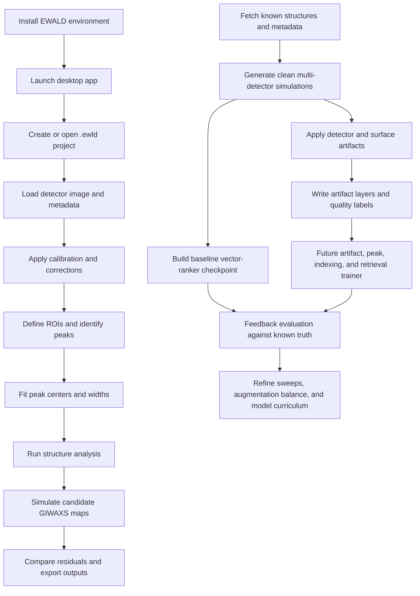

# EWALD Workflow And Execution Report

Date: 2026-05-31

PDF version: [workflow-execution-report.pdf](workflow-execution-report.pdf)

## Executive Summary

EWALD is organized around two complementary operating modes:

| Mode             | Primary user                  | Main outcome                                                                                                                                    |
| ---------------- | ----------------------------- | ----------------------------------------------------------------------------------------------------------------------------------------------- |
| Desktop analysis | GIWAXS/WAXS researchers       | Correct detector data, define ROIs, fit peaks, compare structures, simulate patterns, and export analysis products.                             |
| Data training    | Developers and model builders | Generate labeled synthetic detector images, apply realistic artifacts, rank candidate structures, and prepare cluster-scale training workflows. |

The desktop workflow is the production-facing scientific workbench. The
`data_training/` workflow is intentionally isolated so large simulation sweeps,
HybriD3 ingestion, Alpine jobs, and future machine-learning experiments can
advance without making the GUI harder to install or maintain.

The current training system is ready for local smoke tests and Alpine staging.
It now supports a clean multi-detector simulation plan for cluster runs, writes
artifact and surface-scattering assessment labels, and keeps a lightweight
vector-ranker checkpoint as the auditable baseline. It does not yet train the
final deep model, but the trigger and manifest contracts are organized so that
artifact segmentation, peak detection, indexing, reciprocal-lattice recovery,
and structure retrieval can be added without changing the HybriD3 ingestion or
dataset-generation stages.

## Operating Principles

- Keep the GUI responsive and project-centered.
- Keep generated datasets, scratch outputs, and model artifacts outside the
  source tree.
- Treat manifests as the contract between simulation, artifacts, training, and
  evaluation.
- Prefer reproducible single-command trigger folders over hand-run notebooks.
- Preserve physical provenance: structure source, condition id, detector
  geometry, orientation/texture distribution, artifact seed, peak truth,
  artifact labels, quality labels, and simulator version should travel with
  every generated image.
- Validate small local examples before submitting cluster jobs.

## Repository Map

| Path                         | Role                        | Notes                                                                                                          |
| ---------------------------- | --------------------------- | -------------------------------------------------------------------------------------------------------------- |
| `src/ewald/app/`             | CLI and application startup | `ewald` and `python -m ewald.app` launch the Qt app.                                                           |
| `src/ewald/ui/`              | Desktop interface           | Main window, data viewer, ROI tools, simulation, structure analysis, and themed controls.                      |
| `src/ewald/processing/`      | Analysis kernels            | Calibration, q-space conversion, fitting, peak detection, and pole figures.                                    |
| `src/ewald/crystallography/` | Structure utilities         | Lattice, CIF, reciprocal-space overlays, and candidate comparison helpers.                                     |
| `src/ewald/simulation/`      | Forward models              | GIWAXS simulation and refinement tools used by the app and training scaffold.                                  |
| `docs/`                      | Public documentation        | MkDocs Material site with tutorials, mathematical foundations, and developer notes.                            |
| `data_training/`             | Isolated training scaffold  | Structure catalogs, HybriD3 parser, simulation plans, artifact recipes, trigger folders, and Alpine templates. |
| `tests/`                     | Main test suite             | Unit and workflow coverage for application and scientific behavior.                                            |
| `data_training/tests/`       | Training scaffold tests     | Focused tests for manifests, parser behavior, artifacts, ranking, and trigger contracts.                       |

## End-To-End Workflow Plan



The upper path is the user-facing analysis workflow. The lower path is the
training-data workflow that will improve structure recognition, peak indexing,
and ranking accuracy over time.

## Desktop Execution

### 1. Create The Environment

```bash
git clone https://github.com/kewh5868/ewald.git
cd ewald
conda env create -f requirements/ewald-py312.yml
conda activate ewald-py312
python -m pip install -e .
```

If the environment already exists:

```bash
conda activate ewald-py312
python -m pip install -e .
```

### 2. Launch EWALD

```bash
ewald
```

Equivalent module form:

```bash
python -m ewald.app
```

Open an existing project:

```bash
ewald path/to/project.ewld
```

### 3. Run The Core Scientific Workflow

1. Create or open a `.ewld` project.
2. Load a detector image and any available calibration metadata.
3. Confirm image orientation, mask, beam center, wavelength, distance, and
   correction settings.
4. Use the Data Viewer to inspect the corrected q-space image.
5. Draw rectangular or arch ROIs for lineouts and azimuthal traces.
6. Identify peaks and fit centers, widths, amplitudes, and backgrounds.
7. Open Structure Analysis to compare fitted peaks with lattice candidates.
8. Toggle approximation-grid overlays when inspecting selected structure
   approximations.
9. Use the GIWAXS Simulation tool to compare candidate structures against the
   experimental map.
10. Export project, peaks, fits, candidate tables, images, and documentation
    assets as needed.

## Data-Training Execution

The training scaffold is designed as six independent triggers. Each trigger is
a run folder with a single `run.sh` entry point.

| Trigger              | Command                                                        | Output                                                                                     |
| -------------------- | -------------------------------------------------------------- | ------------------------------------------------------------------------------------------ |
| Fetch structures     | `bash data_training/deploy/00_fetch_hybrid3_structures/run.sh` | HybriD3 catalog, raw downloads, converted structures, ingest manifest.                     |
| Generate simulations | `bash data_training/deploy/01_generate_simulations/run.sh`     | Clean 2D TIFF images, peak truth tables, detector/orientation labels, simulation manifest. |
| Apply artifacts      | `bash data_training/deploy/02_apply_artifacts/run.sh`          | Artifact TIFF images, artifact-layer labels, quality labels, artifact manifest.            |
| Train ranker         | `bash data_training/deploy/03_train_ranker/run.sh`             | Baseline vector-ranker checkpoint now; future learned trainer hook later.                  |
| Feedback evaluation  | `bash data_training/deploy/04_feedback_evaluate/run.sh`        | Top-k ranking metrics and failure summaries.                                               |
| Export guesses       | `bash data_training/deploy/05_export_structure_guesses/run.sh` | Top-k copied structure files and `ranked_guesses.json`.                                    |

### Local Smoke Run

The default trigger settings are intentionally small and local.

```bash
bash data_training/deploy/00_fetch_hybrid3_structures/run.sh
bash data_training/deploy/01_generate_simulations/run.sh
bash data_training/deploy/02_apply_artifacts/run.sh
bash data_training/deploy/03_train_ranker/run.sh
bash data_training/deploy/04_feedback_evaluate/run.sh
bash data_training/deploy/05_export_structure_guesses/run.sh
```

Each trigger writes a timestamped run folder under `data_training/runs/` unless
`EWALD_RUN_BASE` or `EWALD_RUN_ID` is set.

### Trigger Configuration

Every trigger has a `run.env.example` file. Copy or source the relevant values
before running production jobs.

HybriD3 fixture mode:

```bash
export EWALD_HYBRID3_MODE=fixture
export EWALD_HYBRID3_LIMIT=2
bash data_training/deploy/00_fetch_hybrid3_structures/run.sh
```

HybriD3 live mode:

```bash
export EWALD_HYBRID3_MODE=live
export EWALD_HYBRID3_LIMIT=0
export EWALD_HYBRID3_PAGE_SIZE=200
export EWALD_HYBRID3_TIMEOUT=60
bash data_training/deploy/00_fetch_hybrid3_structures/run.sh
```

Clean simulation generation:

```bash
export EWALD_STRUCTURE_CATALOG=data_training/catalog/structures.example.yaml
export EWALD_SIM_PLAN=data_training/configs/simulation_clean.example.yaml
export EWALD_SIM_DRY_RUN=0
bash data_training/deploy/01_generate_simulations/run.sh
```

Alpine-oriented clean simulation generation:

```bash
export EWALD_STRUCTURE_CATALOG=/scratch/alpine/$USER/ewald-training/libraries/hybrid3/hybrid3_structure_catalog.yaml
export EWALD_SIM_PLAN=data_training/configs/simulation_alpine_fibril_training.example.yaml
export EWALD_SIM_DRY_RUN=0
bash data_training/deploy/01_generate_simulations/run.sh
```

The Alpine example plan uses a `detectors:` list, so every structure is
evaluated across multiple detector windows, incident angles, and q-ranges before
the artifact stage expands the clean truth images. The current default examples
remain biased toward 2-3 inverse angstroms so the solver learns to operate with
realistic limited GIWAXS information.

Artifact augmentation:

```bash
export EWALD_CLEAN_ROOT=data_training/runs/01_generate_simulations_example/simulations
export EWALD_CLEAN_MANIFEST=data_training/runs/01_generate_simulations_example/simulations/manifest.jsonl
export EWALD_ARTIFACT_VARIANTS=1
bash data_training/deploy/02_apply_artifacts/run.sh
```

Ranker checkpoint:

```bash
export EWALD_TRAIN_SOURCE_ROOT=data_training/runs/01_generate_simulations_example/simulations
export EWALD_TRAIN_MANIFEST=data_training/runs/01_generate_simulations_example/simulations/manifest.jsonl
bash data_training/deploy/03_train_ranker/run.sh
```

Feedback evaluation:

```bash
export EWALD_MODEL_PATH=data_training/runs/03_train_ranker_example/model/vector_ranker.json
export EWALD_EVAL_ROOT=data_training/runs/02_apply_artifacts_example/artifacts
export EWALD_EVAL_MANIFEST=data_training/runs/02_apply_artifacts_example/artifacts/artifact_manifest.jsonl
export EWALD_FEEDBACK_TOP_K=5
bash data_training/deploy/04_feedback_evaluate/run.sh
```

## HybriD3 Structure Ingestion

The HybriD3 parser handles common structure-file variants encountered on the
website:

| Family                        | Supported variants                                                |
| ----------------------------- | ----------------------------------------------------------------- |
| Crystallographic text         | `.cif`, `.mcif`                                                   |
| VASP-style                    | `POSCAR`, `CONTCAR`, `.vasp`, `.poscar`                           |
| FHI-aims                      | `geometry.in` and compatible lattice-vector files                 |
| CASTEP                        | `.cell` files with lattice and fractional or absolute positions   |
| Molecular/crystal interchange | Extended `.xyz` with `Lattice`, `.pdb` with `CRYST1`              |
| SHELX                         | Simple `.res` and `.ins` files                                    |
| Archives                      | `.zip`, `.tar`, `.tgz`, `.tar.gz` containing supported structures |
| Gzip wrappers                 | `.cif.gz`, `POSCAR.gz`, and related gzip-wrapped structure files  |

Unsupported downloads remain in the raw folder and are marked missing in the
ingest manifest. They do not silently enter the simulation catalog.

The generated catalog also preserves metadata useful for machine learning and
interpretability:

| Metadata class          | Examples                                                                                                                                   |
| ----------------------- | ------------------------------------------------------------------------------------------------------------------------------------------ |
| HybriD3 system fields   | Compound formula, organic formula, inorganic formula, group formula, IUPAC name, dimensionality, layer count `n`, and database tags.       |
| Provenance fields       | Experimental/computational origin, sample type, extraction method, creator/updater, verification, and representative status.               |
| Reference fields        | Title, journal, year, DOI/ISBN, volume, and page fields when available.                                                                    |
| Crystallographic fields | Cell parameters, crystal system, space-group name, formula moieties, formula-derived element counts, atom-site counts, and species counts. |

## Alpine Execution Plan

The Alpine workflow separates source code, scratch data, and compact synced
outputs.

| Location          | Purpose                           | Typical contents                                                        |
| ----------------- | --------------------------------- | ----------------------------------------------------------------------- |
| Local checkout    | Development and small smoke tests | Source code, docs, configs, small fixtures.                             |
| Runtime directory | Cluster execution package         | Staged repo, structure catalogs, plans, logs, SLURM scripts.            |
| Scratch directory | High-volume generated data        | TIFFs, arrays, peak tables, per-task manifests, training intermediates. |
| Sync directory    | Returned compact outputs          | Merged manifests, metrics, model cards, selected previews.              |

CU Boulder CURC documents Alpine allocations as Slurm accounts, requested with
`--account`, and lists `amilan` as the default general CPU partition. GPU
partitions such as `aa100` or `ami100` can be selected later for deep-learning
training jobs that request `--gres=gpu`.

### 1. Configure Paths

```bash
cp data_training/cluster/alpine.paths.example.env data_training/cluster/alpine.paths.env
$EDITOR data_training/cluster/alpine.paths.env
```

The file should define the Alpine host, runtime directory, scratch directory,
project directory, conda environment, and sync settings. Keep credentials out of
this file.

Set the Ascent Slurm account exactly as assigned by CURC:

```bash
export EWALD_ALPINE_ACCOUNT="your_ascent_slurm_account"
export EWALD_ALPINE_PARTITION=amilan
export EWALD_ALPINE_QOS=normal
```

### 2. Stage And Bootstrap

```bash
bash data_training/cluster/scripts/stage_to_cluster.sh data_training/cluster/alpine.paths.env
bash data_training/cluster/scripts/bootstrap_remote_runtime.sh data_training/cluster/alpine.paths.env
```

### 3. Open A Remote Session

```bash
bash data_training/cluster/scripts/remote_dev_session.sh data_training/cluster/alpine.paths.env
```

This opens or reattaches a persistent `tmux` session inside the staged checkout.

### 4. Submit A Trigger Folder

```bash
bash data_training/cluster/scripts/submit_deploy_trigger.sh \
  data_training/cluster/alpine.paths.env \
  data_training/deploy/01_generate_simulations
```

For the full dependent Ascent pipeline:

```bash
bash data_training/cluster/scripts/submit_ascent_pipeline.sh \
  data_training/cluster/alpine.paths.env
```

This submits compute-node jobs for:

| Stage | Slurm job purpose                                                   | Main output                                                                              |
| ----- | ------------------------------------------------------------------- | ---------------------------------------------------------------------------------------- |
| `00`  | HybriD3 live extraction and enriched structure-library construction | `hybrid3_structure_catalog.yaml` and raw/converted structures.                           |
| `01`  | Clean multi-detector GIWAXS simulation dataset construction         | `clean.tiff`, `peaks.json`, `labels.json`, `manifest.jsonl`.                             |
| `02`  | Artificial detector and surface-scattering artifact incorporation   | `artifact.tiff`, `artifact_assessment`, `quality_assessment`, `artifact_manifest.jsonl`. |
| `03`  | Baseline ranker training; future learned trainer slot               | `vector_ranker.json` now, future checkpoints/model card later.                           |
| `04`  | Feedback evaluation against known structure truth                   | top-k metrics, artifact-stratified rows, per-sample ranking records.                     |
| `05`  | Structure-file guess export                                         | copied top-k known structures and `ranked_guesses.json`.                                 |

Start with `EWALD_HYBRID3_LIMIT=25` or lower. Set
`EWALD_HYBRID3_LIMIT=0` only after the staged environment, scratch space,
network behavior, and output manifests have been checked.

The default Ascent submitter uses
`data_training/configs/simulation_alpine_fibril_training.example.yaml`. Override
`EWALD_SIM_PLAN` when running an ablation, a smaller smoke plan, or a
detector-specific shard.

### Scale-Up Ladder

1. Run all six triggers locally in fixture mode.
2. Stage Alpine and run `00` in fixture mode from a compute node.
3. Run `00` in live mode with `EWALD_HYBRID3_LIMIT=10-25`.
4. Run `01` with the multi-detector clean plan and inspect `labels.json`,
   `peaks.json`, q-ranges, and hkl coverage.
5. Run `02` with one variant per profile; inspect `artifact_assessment`,
   `quality_assessment`, and preview images before increasing variants.
6. Run `03-05` to verify baseline ranking, feedback metrics, and exported
   top-k structures.
7. Only after the baseline loop is stable, switch the training trigger or GPU
   template to the learned artifact/peak/indexing trainer.

### 5. Monitor And Sync

```bash
bash data_training/cluster/scripts/cluster_status.sh data_training/cluster/alpine.paths.env
bash data_training/cluster/scripts/tail_cluster_logs.sh data_training/cluster/alpine.paths.env
bash data_training/cluster/scripts/sync_manifests_from_cluster.sh data_training/cluster/alpine.paths.env
```

Large detector images remain on Alpine scratch by default. Set
`EWALD_SYNC_LARGE_OUTPUTS=1` only when intentionally mirroring high-volume
outputs.

## Manifest Contract

The manifest is the durable boundary between pipeline stages. Generated samples
should expose:

| Artifact         | Purpose                                                                                                                                                           |
| ---------------- | ----------------------------------------------------------------------------------------------------------------------------------------------------------------- |
| `clean.tiff`     | Artifact-free simulated image.                                                                                                                                    |
| `artifact.tiff`  | Image used by the model or feedback evaluator.                                                                                                                    |
| `peaks.json`     | Truth table with `(h, k, l)`, `qxy`, `qz`, Bragg intensity, rendered amplitude, and artifact-overlap annotations when available.                                  |
| `labels.json`    | Structure id, condition id, detector geometry, orientation/texture settings, artifact recipe, artifact-layer labels, quality labels, random seed, and provenance. |
| `manifest.jsonl` | Compact row per sample for downstream training and validation.                                                                                                    |

Future trainers should consume manifests rather than scanning directories. This
keeps cluster retries, dataset publication, and validation reproducible.

## Training Feedback Loop

The intended machine-learning path is staged so each model learns from known
synthetic truth before it is asked to solve unknown experimental images.

1. **Artifact and defect recognition**
   Train a segmentation/classification head from `artifact_assessment` labels:
   direct beam, specular reflection, Yoneda band, substrate horizon, footprint
   spillage, critical-angle splitting, detector gaps, beamstop shadows,
   hot/dead pixels, and dead-pixel clusters.
2. **True-peak isolation**
   Use `peaks.json` and `artifact_assessed_peaks` to teach the model which
   bright features are true Bragg peaks and which are detector/surface
   aberrations.
3. **Peak indexing**
   Predict `(h, k, l)`, reflection families, or reciprocal-basis candidates
   from cleaned peak clouds and local image crops.
4. **Reciprocal-lattice construction**
   Infer the reciprocal lattice from the indexed peak set, including missing
   peaks and masked detector regions.
5. **Real-lattice and structure retrieval**
   Convert reciprocal-lattice guesses to real-lattice candidates, compare them
   with the HybriD3 structure catalog, and return ranked structure guesses.
6. **Feedback sampling**
   Group failures by structure family, detector, q-range, incident angle,
   artifact profile, orientation distribution, hkl coverage, and quality score.
   Feed those failures back into the next simulation and augmentation sweep.

## Mathematical Ranking Contract

The current baseline treats the corrected experimental image as a normalized
state:

\[
\lvert \psi \rangle
=
\frac{M W I*{\mathrm{exp}}}
{\lVert M W I*{\mathrm{exp}} \rVert_2}
\]

For a catalog structure \(S_j\) under condition \(c\), the simulated standard is:

\[
\lvert \phi*{j,c} \rangle
=
\frac{M W I*{\mathrm{sim}}(S*j,c)}
{\lVert M W I*{\mathrm{sim}}(S_j,c) \rVert_2}
\]

The score is the overlap:

\[
s(j,c) = \langle \phi\_{j,c} \mid \psi \rangle.
\]

The best structure is:

\[
j^\star = \arg\max_j \max_c s(j,c).
\]

This baseline is deliberately transparent. Future learned models should improve
robustness to weak peaks, missing detector regions, mixed phases, calibration
drift, and realistic artifacts while continuing to report top-k candidates,
score gaps, and residual confidence.

## Quality Gates

Run the focused checks before merging data-training changes:

```bash
conda run --no-capture-output -n ewald-py312 python -m black data_training/src/ewald_data_training data_training/tests
conda run --no-capture-output -n ewald-py312 python -m pytest data_training/tests -q
conda run --no-capture-output -n ewald-py312 python -m compileall data_training/src/ewald_data_training
git diff --check -- data_training docs
```

Run broader repository checks before release:

```bash
conda run --no-capture-output -n ewald-py312 python -m pytest
conda run --no-capture-output -n ewald-py312 mkdocs build --strict
```

For frontend behavior, use the desktop smoke path:

1. Launch `ewald`.
2. Open or create a project.
3. Load the sample image used for tutorials or validation.
4. Exercise Data Viewer, ROI creation, Peak Identification, Structure Analysis,
   GIWAXS Simulation, and exports.
5. Confirm no layout overlap, stale selections, blocking operations, or missing
   project-state updates.

For memory behavior, validate repeated open/close and processing loops with a
small dataset first, then monitor longer sessions with platform tools such as
Activity Monitor, `top`, or Python allocation profilers. Any memory test should
record the input project, operation loop, duration, peak resident memory, and
whether memory returns to baseline after closing views.

## Publication And Dataset Policy

Do not commit generated detector-image datasets to the source repository. Store
large training outputs in scratch, object storage, or a separate dataset release.

Before publishing generated datasets:

1. Verify structure-source license and redistribution terms.
2. Preserve the structure catalog and ingestion manifest.
3. Preserve condition, artifact, and random-seed metadata.
4. Publish a small preview set separately from the full tensor payload.
5. Include a model or dataset card explaining simulation assumptions,
   limitations, and recommended validation splits.

## Current Readiness

| Capability               | Status                                 | Notes                                                                                                                 |
| ------------------------ | -------------------------------------- | --------------------------------------------------------------------------------------------------------------------- |
| Desktop launch           | Ready                                  | `ewald` and `python -m ewald.app` are the supported launch commands.                                                  |
| Documentation site       | Ready                                  | MkDocs Material site is configured with math and Mermaid support.                                                     |
| HybriD3 ingestion        | Ready for smoke and staged live use    | Parser handles common direct, compressed, and archived structure variants.                                            |
| Clean simulation trigger | Ready for local and Alpine smoke tests | Uses EWALD GIWAXS simulation interfaces and supports multi-detector YAML plans.                                       |
| Artifact trigger         | Ready for local and Alpine smoke tests | Applies deterministic detector/surface corruptions and writes artifact/quality labels.                                |
| Ranker trigger           | Baseline now, extensible later         | Builds vector-ranker checkpoint; future learned trainer should keep the manifest contract.                            |
| Feedback trigger         | Ready for baseline metrics             | Evaluates artifact images against known structure truth and artifact-aware weights.                                   |
| Alpine staging           | Ready for configured account testing   | Requires user-specific `alpine.paths.env` and SSH access.                                                             |
| Deep model training      | Planned                                | Artifact, peak, indexing, retrieval, and feedback contracts are present; model implementation intentionally deferred. |

## Immediate Next Steps

1. Run a complete local trigger chain using fixture structures.
2. Configure `data_training/cluster/alpine.paths.env` for the target Alpine
   account.
3. Stage the repository and run the fixture-mode trigger on Alpine.
4. Run a small live HybriD3 ingestion with a low limit.
5. Generate a small clean multi-detector simulation shard and artifact shard on
   scratch.
6. Sync manifests and previews back.
7. Review hkl coverage, q-range coverage, artifact solvability, top-k metrics,
   and structure-family confusion before scaling to full HybriD3 ingestion or
   model training.

## Reference Documents

- `README.md`
- `docs/getting-started/installation.md`
- `docs/getting-started/quickstart.md`
- `docs/guides/mathematical-foundations.md`
- `docs/development/data-training.md`
- `data_training/README.md`
- `data_training/deploy/README.md`
- `data_training/cluster/README.md`
- `data_training/cluster/REMOTE_ALPINE.md`
- `data_training/reports/training_framework_report.md`
- `data_training/reports/trigger_pipeline_design.md`
- `data_training/reports/dirac_structure_ranking.md`
- CU Boulder CURC Alpine hardware and Slurm resource guide:
  `https://research-computing-user-tutorials.readthedocs.io/en/stable/clusters/alpine/alpine-hardware.html`
