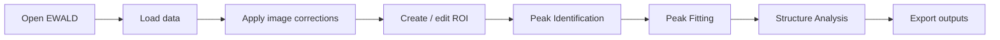
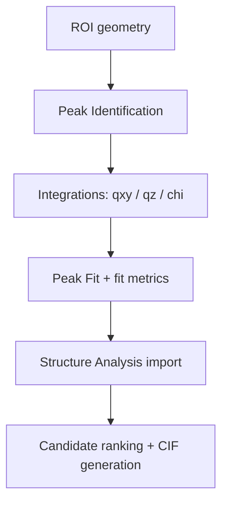
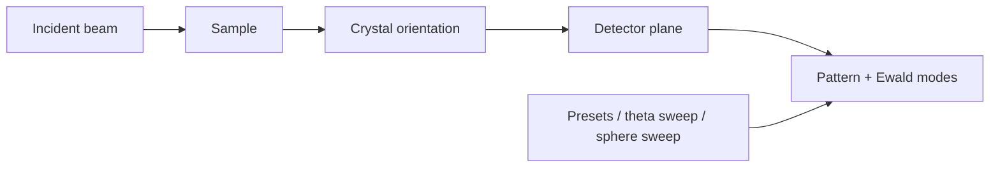
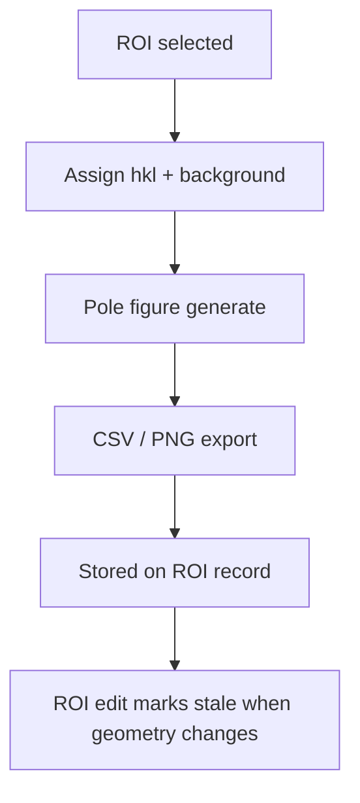
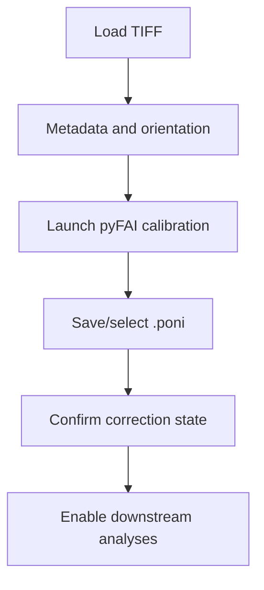

# Assets and Diagrams

EWALD documentation uses text-based diagrams and screenshot placeholders so the site
builds in any environment without blocking media capture.

## Screenshots and placeholders

Current screenshot placeholders live in:

- `docs/assets/placeholders/`

Use these files until a real screenshot is captured:

- `apply-corrections.svg`
- `calibration-workflow.svg`
- `corrections-workflow.svg`
- `data-loading.svg`
- `film-optics.svg`
- `loading-data.svg`
- `peak-fitting.svg`
- `peak-identification.svg`
- `pole-figure.svg`
- `roi-tools.svg`
- `simulation.svg`
- `structure-analysis.svg`
- `tutorial-roi.svg`
- `ui-main-window.svg`

### Replacing placeholders

1. Capture matching screen at runtime and save as PNG in the same path.
2. Keep aspect ratio so references stay stable.
3. Use short, workflow-oriented filenames.
4. Update the corresponding Markdown link paths only if the file names change.

If replacements are not yet available, leave placeholders in place and mark the status as
**Planned** or **Experimental** in nearby documentation where behavior is incomplete.

## Diagram support

This site uses the MkDocs Mermaid plugin (`mkdocs-mermaid2-plugin`) and the project
supports Mermaid blocks directly in Markdown.

### EWALD workflow

Source: `docs/assets/diagrams/ewald-workflow.mmd`

### ROI to Peak Fit to Structure Analysis data flow

Source: `docs/assets/diagrams/roi-to-structure-flow.mmd`

### Simulation geometry

Source: `docs/assets/diagrams/simulation-geometry.mmd`

### Pole figure workflow

Source: `docs/assets/diagrams/pole-figure-workflow.mmd`

### Calibration workflow

Source: `docs/assets/diagrams/calibration-workflow.mmd`

## Why placeholders are useful

- Keep CI and docs build reproducible before large UI captures are produced.
- Prevent broken links when UI screenshots are being refreshed.
- Track missing media in one section and keep workflow pages easier to read.
