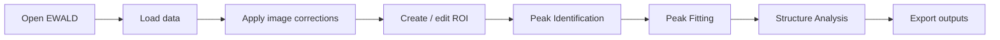
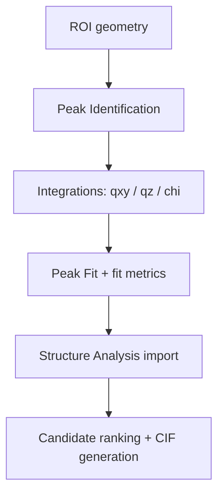
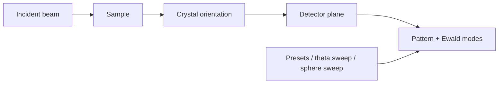
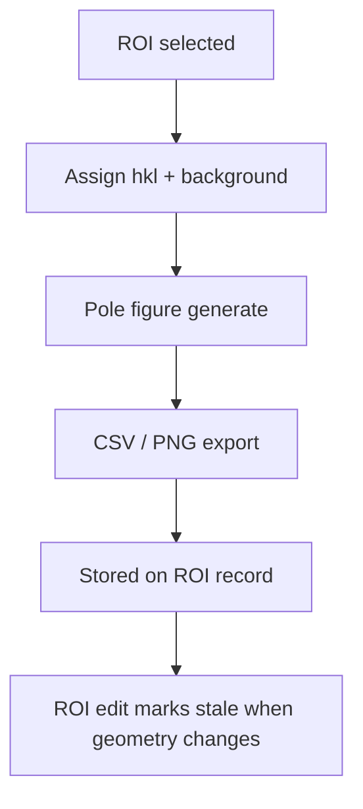
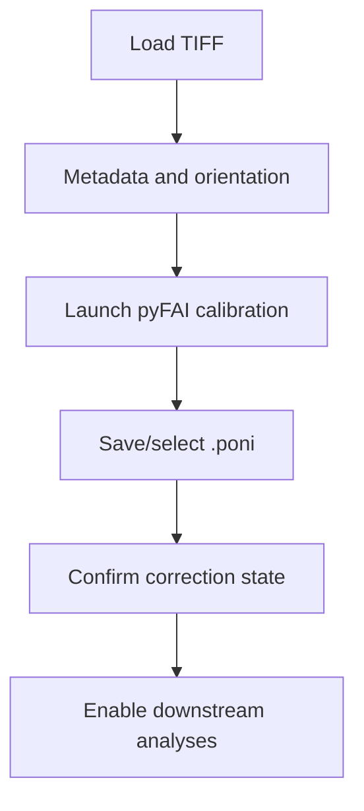

# Assets and Diagrams

!!! warning "Documentation notice"
    This documentation was generated with help from a large language model and has not been fully vetted by the developer. Verify critical details against the source code and current application behavior.


EWALD documentation uses generated workflow screenshots, text-based diagrams, and
fallback placeholders so the site builds in any environment without blocking media
capture.

## Screenshots and placeholders

Current tutorial screenshots live in:

- `docs/assets/screenshots/tutorials/`

Regenerate them from the repository root with:

```bash
python scripts/generate_tutorial_screenshots.py
```

The generator opens EWALD widgets offscreen, loads example or synthetic tutorial data,
and captures these documentation-ready PNG files:

- `ui-main-window.png`
- `apply-corrections.png`
- `data-viewer-rois.png`
- `peak-identification.png`
- `peak-fitting.png`
- `structure-analysis.png`
- `pole-figure.png`
- `giwaxs-simulation.png`

Fallback screenshot placeholders live in:

- `docs/assets/placeholders/`

Use these files only when a matching runtime capture is not available:

- `apply-corrections.svg`
- `calibration-workflow.svg`
- `corrections-workflow.svg`
- `data-loading.svg`
- `film-optics.svg`
- `loading-data.svg`
- `peak-fitting.svg`
- `peak-identification.svg`
- `pole-figure.svg`
- `roi-tools.svg`
- `simulation.svg`
- `structure-analysis.svg`
- `tutorial-roi.svg`
- `ui-main-window.svg`

### Refreshing captures

1. Run the screenshot generator from the active EWALD environment.
2. Review each PNG for clipping, blank content, and stale UI labels.
3. Keep short, workflow-oriented filenames.
4. Update Markdown links only when a capture is added, removed, or renamed.

If replacements are not yet available, leave placeholders in place and mark the status as
**Planned** or **Experimental** in nearby documentation where behavior is incomplete.

## Diagram support

This site uses the MkDocs Mermaid plugin (`mkdocs-mermaid2-plugin`) and the project
supports Mermaid blocks directly in Markdown.

### EWALD workflow



Source: `docs/assets/diagrams/ewald-workflow.mmd`

### ROI to Peak Fit to Structure Analysis data flow



Source: `docs/assets/diagrams/roi-to-structure-flow.mmd`

### Simulation geometry



Source: `docs/assets/diagrams/simulation-geometry.mmd`

### Pole figure workflow



Source: `docs/assets/diagrams/pole-figure-workflow.mmd`

### Calibration workflow



Source: `docs/assets/diagrams/calibration-workflow.mmd`

## Why placeholders are useful

- Keep CI and docs build reproducible before large UI captures are produced.
- Prevent broken links when UI screenshots are being refreshed.
- Track missing media in one section and keep workflow pages easier to read.
