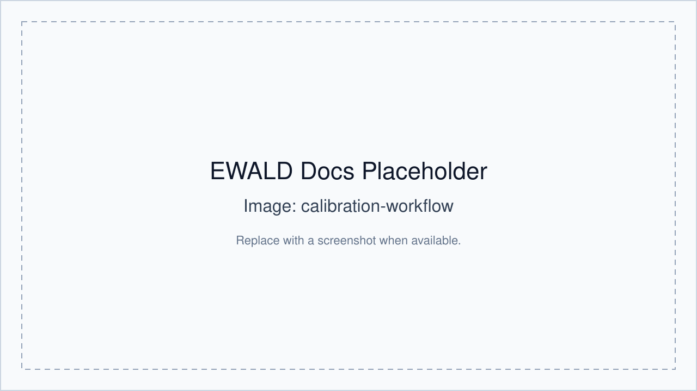

# Calibration

Calibration in EWALD includes pyFAI geometry setup and correction parameter selection.

## pyFAI-calib2 / pyFAI integration

- EWALD launches **pyFAI-calib2** through a managed launcher in `Tools`.
- The launcher prevents duplicate live processes.
- Selected PONI calibration assets are then used in correction and mapping.

## Launch from EWALD

Open:

1. `Tools` → **PyFAI Calibration/Mask Tool**
2. Set/confirm detector geometry and save a `.poni` file.
3. Import or reload the calibrant in EWALD as a correction asset.

### Avoiding duplicate launches

EWALD uses a process guard; a second launch click while pyFAI is running will be
ignored and surfaced as a status notification.

## Launch from Data Viewer context

- The launcher is shared for workflows that already have an active project target.
- Use this when the selected geometry needs quick refinement.

## Downstream usage

The selected PONI is part of the correction state for each confirmed data target.
This state gates opening downstream tabs in the right panel.

## Common issues

- Missing `pyfai-calib2` in PATH: install or activate an environment where it is available.
- Wrong target orientation: check rotation/mirror settings after calibration.
- Unconfirmed correction state: downstream tabs remain disabled until confirm.

