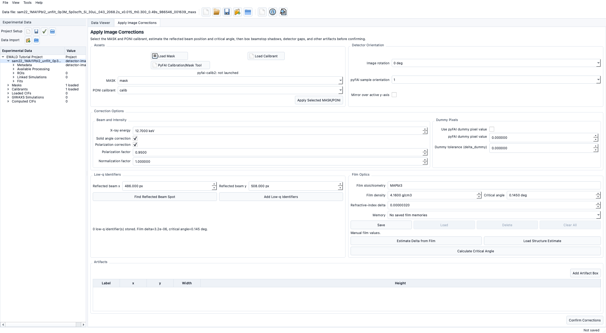

# Film Optics

!!! warning "Documentation notice"
This documentation was generated with help from a large language model and has not been fully vetted by the developer. Verify critical details against the source code and current application behavior.

Film optics inputs are managed in Apply Image Corrections and affect low-q behavior.

## Inputs

- Stoichiometry (string formula-like input).
- Density (g/cm3).
- Optional structure reference file estimate for density/refractive values.

## Stored memory

EWALD stores reusable film inputs:

- Save current stoichiometry/density entries.
- Load previous entries from project memory.
- Clear/delete memory entries.

## Supported structure files

- `.cif`, `.mcif`
- `POSCAR*`, `CONTCAR*`
- `*.vasp`

## Estimation workflow

- Estimate refractive delta and critical angle from film composition + density + X-ray energy.
- Values can be applied directly to correction calculations.

## How values are applied

- Corrections and low-q labels use the active correction state values.
- Saved values persist with the project and can be replaced per data target.

## Planned or limited

- Advanced optical stack models are currently **Planned**.

