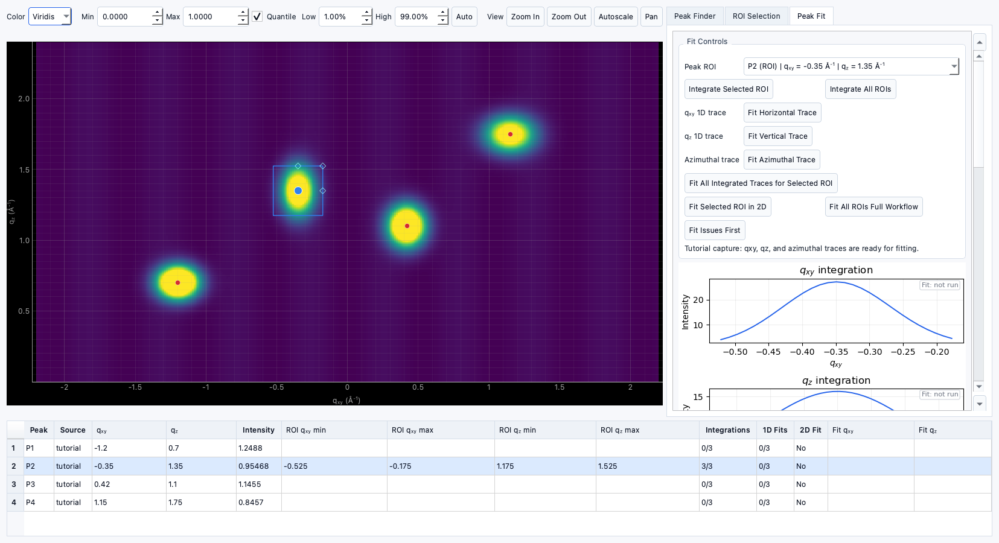

# Peak Fitting

!!! warning "Documentation notice"
This documentation was generated with help from a large language model and has not been fully vetted by the developer. Verify critical details against the source code and current application behavior.

Peak Fitting converts selected ROI regions into integrated traces and model fits.

## Integrating ROIs

- Integrate selected ROI or all ROIs in the active target.
- Supported traces:
  - `qxy` lineout
  - `qz` lineout
  - `Azimuthal`/`chi` profile

## Fitting traces

- Each 1D trace is fitted to a Gaussian-plus-offset model.
- A 2D ROI fit is also available for coupled fitting of `qxy` and `qz`.

## `R_w` and fit metrics

- Fit quality includes per-parameter statistics and fit status.
- `r_w` is reported in fit result metadata when available through summary metrics.

## Result interpretation

- Successful fit centers propagate to peak tables.
- Unfit traces remain marked as not run.
- Users should validate centers and metrics before structure interpretation.

## Structure Analysis propagation

- Peak centers and metrics are synced into **Structure Analysis** as source rows.
- User-edited centers are preserved if explicitly changed there.

## Planned / experimental

- Additional curve types and multi-peak decomposition are currently **Planned**.

