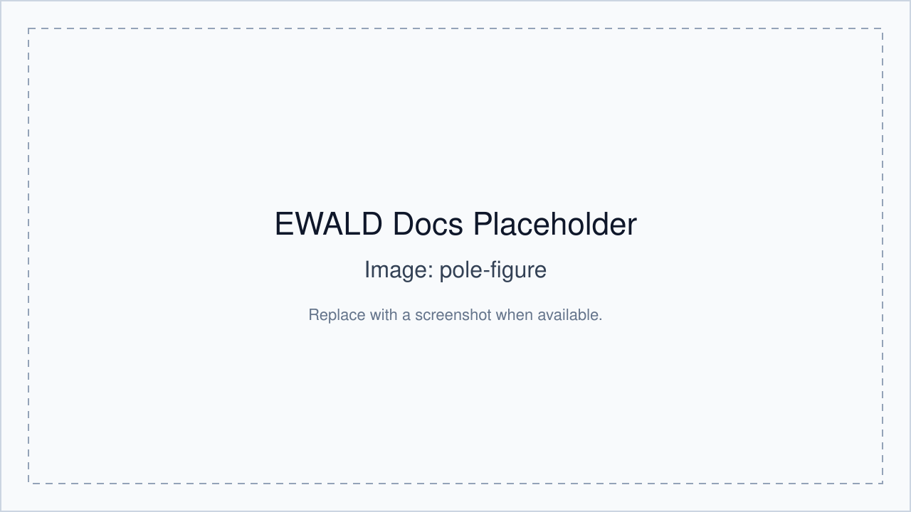

# Pole Figure Generator

The Pole Figure tool is launched from EWALD with selected data context.

## Launching

- Open from main workflow action/button with an ROI selected.
- A separate window receives ROI, `qxy`, and `qz` context.

## hkl labels

- Enter `h`, `k`, `l`, optional label text, and display name.

## Background subtraction modes

- No subtraction
- Constant background
- Local annular/neighbor subtraction
- ROI-based background
- Polynomial baseline

## Exporting pole figures

- Export CSV and PNG outputs from the generator window.
- Metadata can be saved with output and reloaded via project history where supported.

## Linking to ROI metadata

- Generated output and status are stored in ROI-linked metadata.
- Stale detection marks outputs as outdated when ROI geometry changes.

## Stale workflow state

- ROI edits can invalidate prior pole figures.
- Re-run to refresh stale status.

