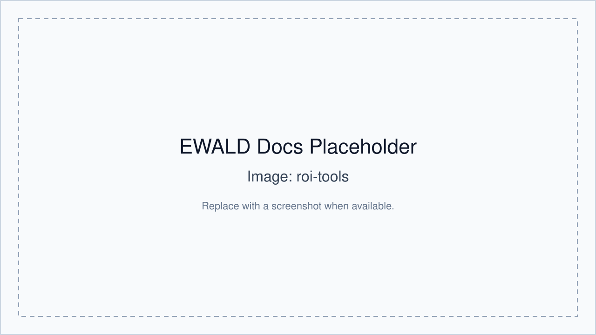

# ROI Tools

ROI tools are the core bridge between Data Viewer and later analysis workflows.

## ROI types

- **Rectangular ROI**: defines a `qxy` by `qz` region.
- **Arch ROI**: defines `qr` and `chi` bounds for azimuthal extraction.

## Coupled ROIs

The UI supports coupled ROI workflows (rectangular + arch). If supported, coupling is
tracked in ROI metadata and used by dependent tools.

## Creating and editing ROIs

- Draw from the Data Viewer plot interactions.
- Edit geometry using the ROI table.
- Resize and reposition ROIs directly on the plot.

## Moving and resizing ROIs

- Drag ROI edges/handles in plot.
- Set integration direction and display states from table controls.

## ROI metadata

Each ROI stores:

- table geometry values
- kind and coupling metadata
- pole-figure and hkl metadata

## hkl and phase tagging

- Open ROI rows in the ROI metadata/edit table.
- Assign `h`, `k`, `l`, and labels.
- These values can be propagated to Peak Identification and Peak Fitting outputs.

## Phase tagging

- Use phase tag fields in the peak/ROI workflow to organize candidate interpretation.

## Gap-estimated peaks

- EWALD supports gap-estimated point behavior as an explicit peak kind in data records.
- Gap markers are distinct from normal measured or manually entered peaks.

## Planned

- Some advanced automatic ROI coupling modes are marked as **Planned** for future UI refinements.

