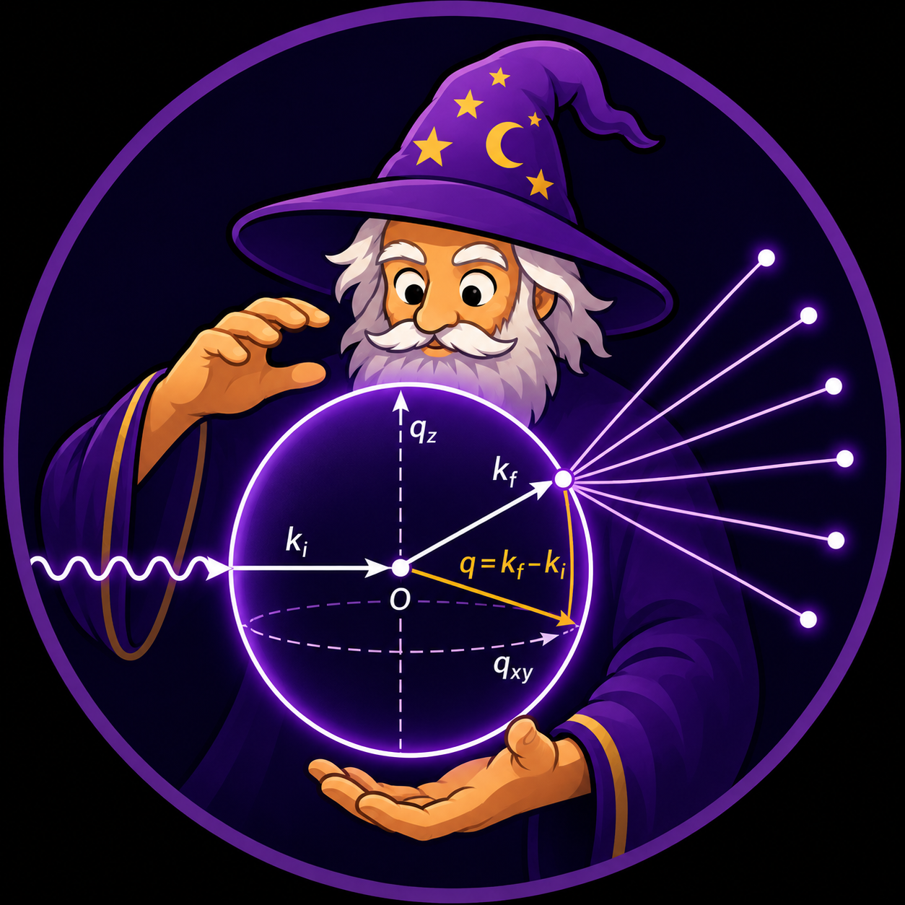

# EWALD Documentation

  

**Experimental WAXS Analysis for Lattice Determination**

!!! note "Package icon"
    The EWALD package icon shown on this site was generated with help from a large language model.

EWALD is a Qt6 scientific workbench for GIWAXS/WAXS analysis. It brings
detector-image import, calibration-aware q-space correction, ROI and peak
fitting workflows, mathematical reciprocal-space conventions, lattice and
structure-candidate ranking, CIF generation, and GIWAXS simulation into one
project-based desktop interface. The simulation workflow compares experimental
scattering targets against solved or generated CIF structures, including
residual difference maps for judging fit quality.

## Quick start

1. Open [Installation](getting-started/installation.md).
2. Launch `ewald` and create or open an `.ewld` project.
3. Open the workflow pages in sequence:
   - [Data Loading](guides/data-loading.md)
   - [User Interface Overview](user-interface/overview.md)
   - [ROI Tools](guides/roi-tools.md)
   - [Peak Identification](guides/peak-identification.md)
   - [Peak Fitting](guides/peak-fitting.md)
   - [Mathematical Foundations](guides/mathematical-foundations.md)
   - [Structure Analysis](guides/structure-analysis.md)

## What EWALD is for

- Correct and inspect detector images in `qxy` and `qz`.
- Build ROI definitions for lineout and azimuthal workflows.
- Integrate peaks and fit `qxy`, `qz`, and azimuthal traces.
- Follow documented derivations for q-space mapping, reciprocal lattices,
  Bragg conditions, ROI integrations, peak fitting, and simulation residuals.
- Rank lattice candidates in **Structure Analysis** and compare with GIWAXS simulations.
- Generate pole figures and export simulation/analysis outputs.

## Main workflow

The standard workflow is:

1. Create or open an `.ewld` project.
2. Import `.tif`/`.tiff` data (single files or folders).
3. Load correction assets (`PONI`, `MASK`) and confirm image correction state.
4. Work in **Data Viewer** and define ROIs.
5. Use **Peak Identification** and **Peak Fit** to produce peak centers and metrics.
6. Import fitted peaks into **Structure Analysis** and evaluate candidate structures.
7. Run or refine GIWAXS simulation as needed.
8. Export outputs for downstream reporting and reuse.

## Documentation map

### Getting started

If this is your first run:

- [Installation and setup](getting-started/installation.md)
- [Quickstart](getting-started/quickstart.md)

### User Guide

- [User Interface Overview](user-interface/overview.md)
- [Data Loading](guides/data-loading.md)
- [Calibration](guides/calibration.md)
- [Detector geometry and corrections](guides/detector-geometry-and-corrections.md)
- [Mathematical Foundations](guides/mathematical-foundations.md)
- [ROI Tools](guides/roi-tools.md)
- [Peak Identification](guides/peak-identification.md)
- [Peak Fitting](guides/peak-fitting.md)
- [Structure Analysis](guides/structure-analysis.md)
- [Pole Figure Generator](guides/pole-figure-generator.md)
- [Film Optics](guides/film-optics.md)
- [Simulation Tool](guides/simulation.md)
- [Troubleshooting](guides/troubleshooting.md)

### Tutorials

Use these for task-based workflows:

- [Loading data and viewing a GIWAXS image](tutorials/loading-data-and-viewing.md)
- [Creating and editing ROIs](tutorials/create-edit-rois.md)
- [Identifying peaks](tutorials/identifying-peaks.md)
- [Fitting `qxy` and `qz` traces](tutorials/fitting-traces.md)
- [Exporting fitted peaks](tutorials/export-fitted-peaks.md)
- [Using Structure Analysis](tutorials/structure-analysis.md)
- [Running a basic simulation](tutorials/run-simulation.md)
- [Using film optics inputs](tutorials/film-optics.md)
- [Building the docs locally](tutorials/build-docs-locally.md)

### Developer

- [Repository Notes](developer/notes.md)
- [Add a new documentation page](developer/add-new-documentation-page.md)
- [Documentation style guide](guides/style-guide.md)
- [Documentation maintenance checklist](developer/maintenance-checklist.md)
- [Project structure](development/repo-structure.md)
- [Feature planning](development/feature-planning.md)

## Scope notes

EWALD is actively developed. This documentation marks each feature as:

- **Implemented** where workflows are currently wired.
- **Experimental** where behavior may change in near-term releases.
- **Planned** for work not yet in the active user path.

Where a feature is not yet implemented, the docs call it out directly in its topic.

Local sample data and generated outputs are not committed to the repository.
Project-specific datasets should live under the ignored `example/projects/`
tree without changing the Git checkout.
