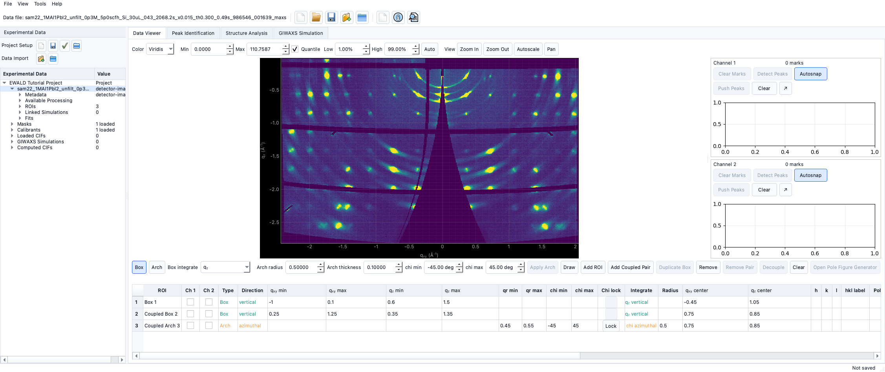

# Tutorial: Building the EWALD docs locally

!!! warning "Documentation notice"
This documentation was generated with help from a large language model and has not been fully vetted by the developer. Verify critical details against the source code and current application behavior.

This tutorial is for contributors and users who want to check docs locally.

## 1) Install docs dependencies

From the repository root:

```bash
python -m pip install -r docs/requirements.txt
```

`docs/requirements.txt` is intentionally isolated from runtime dependencies.

## 2) Preview docs with live reload

```bash
mkdocs serve
```

Then open the local URL printed by MkDocs (usually `http://127.0.0.1:8000`).

## 3) Build static docs

```bash
mkdocs build
```

The built site appears in `site/`.

## 4) Check for warnings

- Build output should be free of hard errors.
- Missing links and missing files usually appear with warning lines.
- If warnings appear, check links, image paths in `docs/assets`, and `mkdocs.yml` nav.

## 5) Refresh docs from screenshots and diagrams

- Generate UI captures from the active EWALD environment:
  ```bash
  python scripts/generate_tutorial_screenshots.py
  ```
- Store runtime captures under `docs/assets/screenshots/tutorials/`.
- Keep placeholders under `docs/assets/placeholders/` only for workflows that do not yet
  have a stable capture.
- Rebuild and confirm all docs pages render cleanly.


