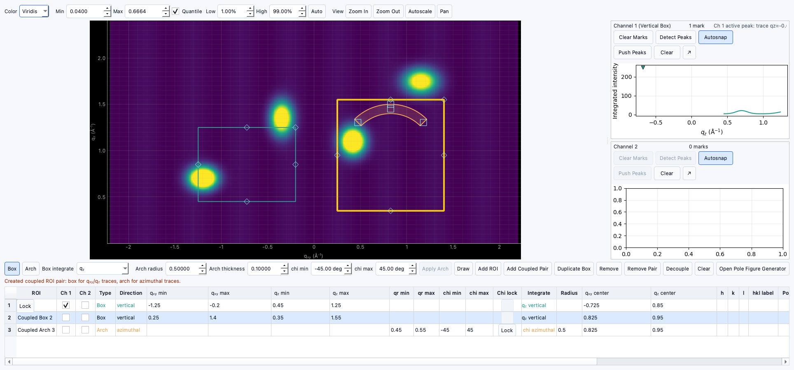

# Tutorial: Creating and editing ROIs

!!! warning "Documentation notice"
This documentation was generated with help from a large language model and has not been fully vetted by the developer. Verify critical details against the source code and current application behavior.

This tutorial covers ROI setup for downstream peak workflows.

## Step 1: Open corrected data

- Confirm image corrections.
- Switch to **Data Viewer**.

## Step 2: Add a box ROI

- Use ROI controls to draw one box.
- Name it and inspect table values.

## Step 3: Add an arch ROI

- Add an arch ROI around a ring-like feature.
- Confirm `chi` span and `qr` bounds.

## Step 4: Edit from table

- Update row values in the ROI table.
- Move and resize handles in the image and verify metadata updates.

## Step 5: Couple ROIs

- If coupling is available for your workflow, pair ROIs and keep geometry aligned.

## Step 6: Save progress

- Save the `.ewld` project frequently.

