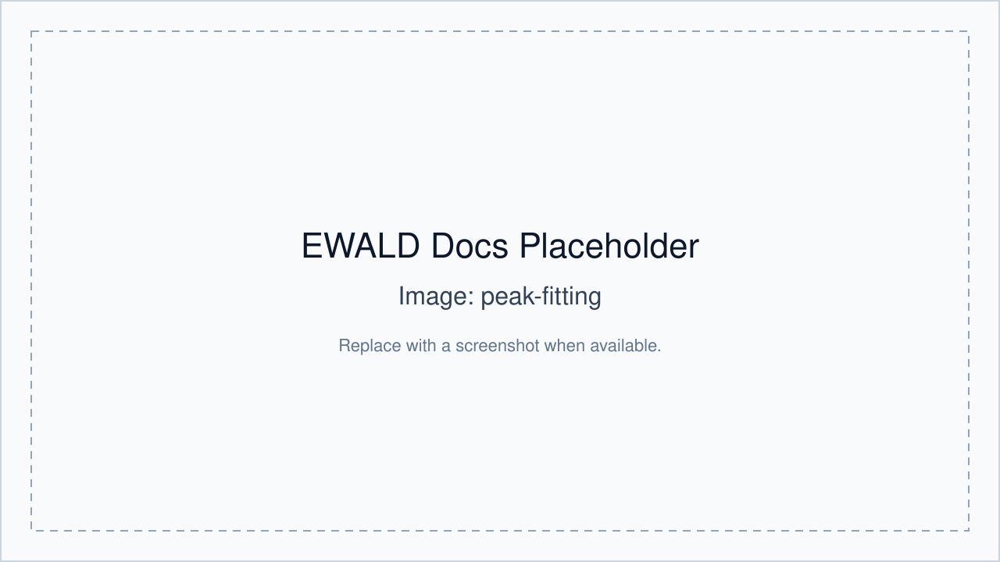

# Tutorial: Fitting `qxy` and `qz` traces

## 1) Select a ROI

- Ensure a box or arch ROI exists.
- Move to **Peak Fit** with a selected ROI.

## 2) Run integrations

- Generate 1D traces for:
  - `qxy`
  - `qz`
  - azimuthal traces (for arch/appropriate contexts)

## 3) Run fits

- Fit each selected trace.
- Review fit status and statistics.

## 4) Inspect 2D fit

- Optional: fit ROI in 2D for joint center estimate.

## 5) Use results

- Push fitted centers into Structure Analysis for candidate evaluation.

