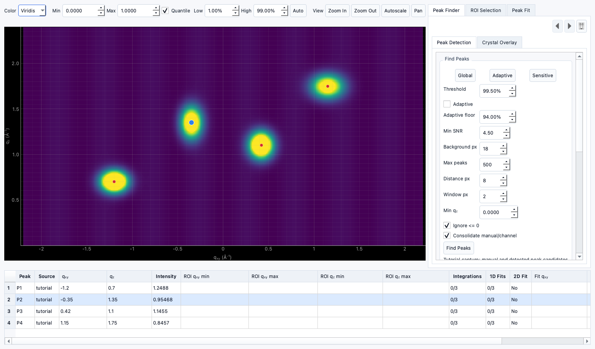

# Tutorial: Identifying peaks

!!! warning "Documentation notice"
    This documentation was generated with help from a large language model and has not been fully vetted by the developer. Verify critical details against the source code and current application behavior.

## 1) Open Peak Identification

- Select an active data target.
- Navigate to **Peak Identification**.

## 2) Place points

- Click on obvious maxima.
- Optionally use snap-to-maximum actions.

## 3) Review channel plot

- Confirm one peak list per ROI or experiment.

## 4) Clean up

- Use undo/redo when adjusting placement.
- Remove accidental points.

