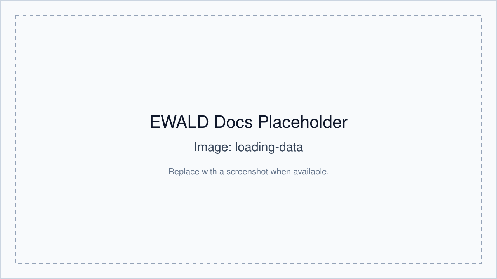

# Tutorial: Loading data and viewing a GIWAXS image

Use this tutorial as the first run-through when you have local TIFF data.

## 1) Open EWALD

```bash
ewald
```

## 2) Create a project

- `File` → **New Project** (or open an existing `.ewld`).

## 3) Import one image

- Choose **Import Data File** and select one `.tif`/`.tiff`.

## 4) Review metadata

- Select filename or header parsing strategy.
- Confirm tokenized metadata entries.

## 5) Apply correction inputs

- Load or create a MASK.
- Load a PONI calibrant.
- Confirm and unlock data viewer.

## 6) Open Data Viewer

- Use `q<sub>xy</sub>` / `q<sub>z</sub>` plotting to inspect corrected features.
- Tune contrast and colormap for visibility.



## 7) Missing example assets

Sample datasets can be kept under a local ignored `example/` folder for
single-image checks. For folder-scale tutorials, use project-local datasets and
document names in your lab storage.
