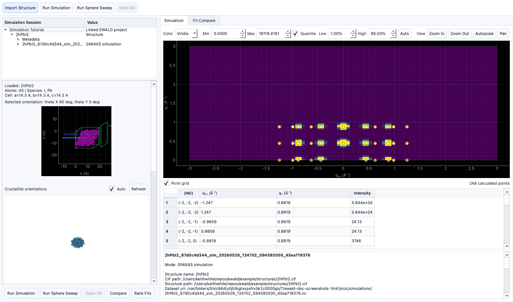

# Tutorial: Running a basic simulation

!!! warning "Documentation notice"
    This documentation was generated with help from a large language model and has not been fully vetted by the developer. Verify critical details against the source code and current application behavior.

This tutorial assumes EWALD data are loaded and a structure candidate is available.

## Prerequisites

- `*.cif`, `*.mcif`, `POSCAR*`, `CONTCAR*`, or `*.vasp` structure file.
- A project target with reasonable detector geometry state.
- `GIWAXS Simulation` tool installed (available in EWALD).

## 1) Open GIWAXS Simulation

From **Tools** or the main workflow tab:

1. Open **GIWAXS Simulation**.
2. Pick a structure source and confirm it is parsed correctly.
3. Choose plotting bounds and detector simulation parameters.

## 2) Set crystal orientation

- Set `theta_x` and `theta_y` to an initial orientation.
- Optionally adjust incident wavelength, sample distance, and extents.
- Use the orientation preview to confirm values.

## 3) Run a simulation mode

### Pattern mode (single orientation)

- Generates one pattern for a specific orientation.
- Use when you want a direct comparison at one crystal pose.

### Ewald sweep mode

- Sweeps `theta_x`/`theta_y` through configured ranges.
- Useful for orientation searching and broad comparison.

## 4) Distinguish sweep modes

- **Pattern mode** computes the current requested orientation.
- **Ewald sphere sweep** generates a stack and can be replayed to inspect orientation evolution.

## 5) Apply orientation presets

- **Single crystal**: minimal spread.
- **2D vertical / 2D horizontal / Isotropic** presets are available for typical sample types.
- Presets are useful first-pass starting points and can be edited after apply.

## 6) Orientation distribution

- Use `sigma_theta`, `sigma_phi`, and related controls to control spread.
- Preview updates in the orientation distribution view.

## 7) Inspect cache behavior

- Re-run with identical settings to reuse cached output.
- Change any input parameter to force a fresh computation.

## 8) Export simulation outputs

- Simulation results are stored as project-linked outputs (including NetCDF-style payloads).
- Reload and compare output records from the simulation table for downstream interpretation.
- Ranked fit comparisons minimize `Difference RMSE`, the RMSE of the displayed
  target-minus-fitted-simulation difference map.
- Use the `Generated CIFs` run/compare control to simulate top Structure
  Analysis CIF candidates and click through their experimental difference maps
  in the Fit Compare table.
- Full standalone external export options are implementation-specific and can be
  expanded in future releases.

## Status

- Pattern and sweep modes, presets, caches, and orientation distribution are implemented.
- Full external batch export options are currently **Planned**.
