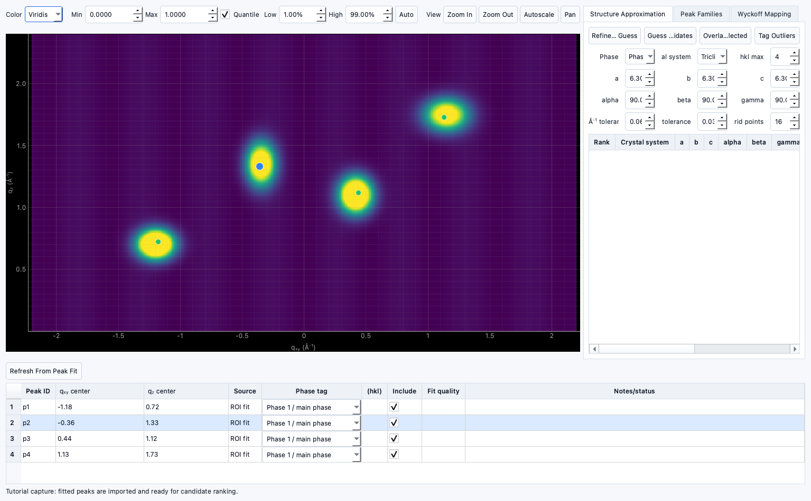

# Tutorial: Using Structure Analysis

!!! warning "Documentation notice"
This documentation was generated with help from a large language model and has not been fully vetted by the developer. Verify critical details against the source code and current application behavior.

Use this sequence after peak fitting to build and rank structure candidates.

## Prerequisites

- Completed or partially complete peak fitting workflow.
- Peak centers imported into **Structure Analysis**.
- One or more structure references (experimental workflow file or candidate seed).

## 1) Open Structure Analysis and load data

1. Open **Structure Analysis** from the main workflow tabs.
2. Confirm active target is the same dataset used for fitting.
3. Import peak positions from current fit output.

## 2) Review and edit peak table values

- Verify `qxy`, `qz`, labels, and phase tags.
- Edit centers if needed for manual correction.
- Use peak metadata to isolate primary vs secondary phases.

## 3) Assign hkl and phase tags

1. Add tentative `(hkl)` values for easy matching.
2. Label phase state (`main`, `secondary`, `unassigned`, `gap`).
3. Filter by family and phase if needed before candidate search.

## 4) Generate and rank candidates

1. Build candidate families from the current filtered peak set.
2. Run structure ranking for the active family set.
3. Review rankings, match counts, and candidate scores.

## 5) Refine a candidate

- Open a promising candidate and run refinement controls.
- Review outlier handling and residual trends.
- Re-run ranking if constraints changed.

## 6) Secondary-phase and Wyckoff work

- Use phase tags to keep secondary/unassigned peaks visible during refinement.
- Use Wyckoff tooling where available for additional validation.
- Advanced Wyckoff workflows are currently marked as **Experimental** and may change.

## 7) Generate CIF records

- Generate ranked CIF outputs when candidates are available.
- The generated records are attached to project output state and can be reviewed and reused.

## Status

- Core workflow steps are implemented.
- Full Wyckoff pipeline depth and some advanced interpretation helpers are currently
  **Experimental**.
