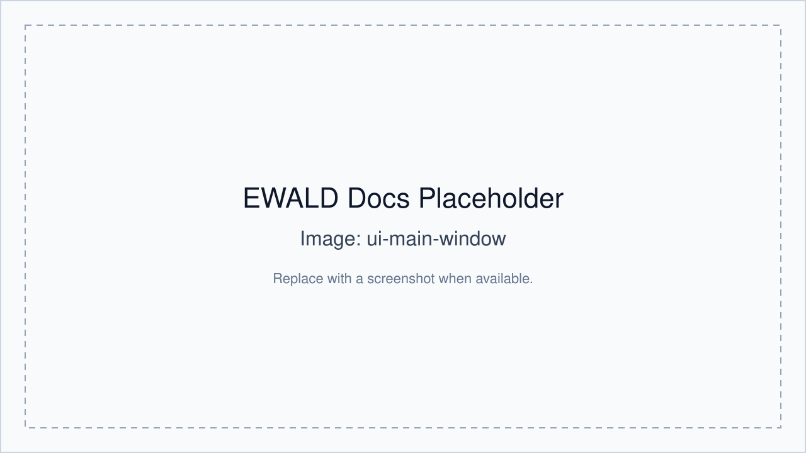

# User Interface Overview

EWALD is organized around the active project target (file or group).

## Main window layout

The main window has:

- Left project dock:
  - `.ewld` project actions (New/Open/Save/Save As).
  - `Experimental Data` tree.
  - Correction asset panels (MASK and PONI).
- Main dock workspace with tabbed workflow views.
- Tool launch actions (PyFAI calibration, GIWAXS simulation, pole figure tool).

### Tabs and panels

- **Project / Data** context (left pane)
- **Apply Image Corrections**
- **Data Viewer**
- **Peak Identification**
- **Structure Analysis**
- **GIWAXS Simulation**
- **Assets and launchers** are available from toolbar/menu actions.

## Workflow tab behavior

EWALD keeps workflow order explicit:

1. Import data into an active project.
2. Configure image corrections.
3. Confirm corrections.
4. Continue with downstream tabs that depend on corrected data.

## Data Viewer

Primary functions:

- Display corrected image in reciprocal space.
- ROI creation, movement, and editing.
- Channel-specific overlays and scaling controls.

## Peak Identification

- Load, add, and edit peak markers on corrected data.
- Sync points to active ROIs.

## Peak Fit

- Compute and fit line traces in `qxy`, `qz`, and azimuthal directions.
- Save fit metrics back into per-target analysis state.

## Structure Analysis

- Import fitted peaks.
- Assign phase labels and phase tags.
- Generate candidate structures and rank fits.

## Simulation tool

- Run and inspect GIWAXS simulations.
- Compare simulated images to data visually.
- Export/replay and cache simulation results.

## Film optics and corrections options

Located in **Apply Image Corrections**:

- Film stoichiometry and density.
- Saved film material memory.
- Refractive estimate helpers.
- Correction asset tracking and low-q markers.

## Detector orientation

Image rotation and optional mirror options are applied before map integration.
These values are carried into downstream orientation handling and q-space mapping.

## Tool launchers

- **PyFAI-calib2 launcher**: separate external calibration helper.
- **Pole Figure Generator**: selected-ROI specific plotting and export.
- **GIWAXS Simulation**: standalone simulation workflow panel (structure load, presets, exports).

